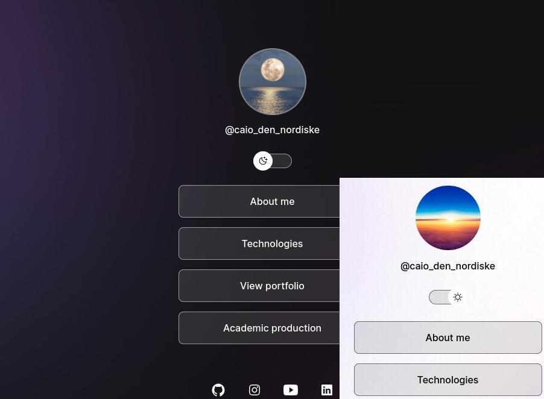

<h1 align="center"> Presentation Card </h1>

A brief summary of myself

  <a href="#-tecnologias">Technologies</a>&nbsp;&nbsp;&nbsp;|&nbsp;&nbsp;&nbsp;
  <a href="#-projeto">Project</a>&nbsp;&nbsp;&nbsp;|&nbsp;&nbsp;&nbsp;
  <a href="#-layout">Layout</a>&nbsp;&nbsp;&nbsp;|&nbsp;&nbsp;&nbsp;
  <a href="#memo-licença">License</a>

  

 

  

## 🚀 Technologies

This project was developed with the following tools:

- HTML & CSS
- JavaScript
- Git & Github

## 💻 Project

This is a simple presentation page with summary info and social links.

## :memo: Licença

This project is under MIT license.

---

Based in the project available in Rocketseat :wave: [Community link!](https://discord.gg/rocketseat)
